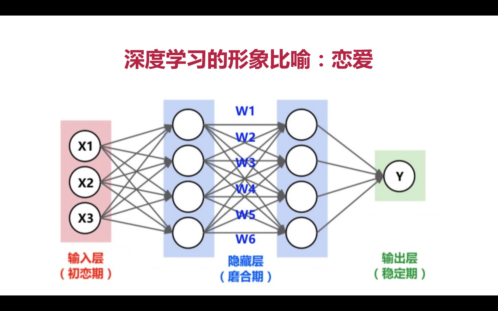

# 第2章 人工智能基础知识

## 2.6 什么是机器学习

### 机器学习算法分类

### 机器学习算法选择

### 机器学习解决问题的六个步骤

+ 1.收集数据
+ 2.准备数据
+ 3.选择并建立模型
+ 4.训练模型
+ 5.测试模型
+ 6.调节参数

### 机器学习的关键三步

+ 找一系列函数来实现预期的功能：**建模**问题
+ 找一组合理的评判标准，来评估函数的好坏：**评价**问题
+ 快速找到性能最佳的函数：**优化**问题(比如**梯度下降**就是这个目的)

## 2.9 什么是深度学习

### 深度学习的三层

+ 输入层：不同的参数设置
+ 隐藏层：调整参数权重
+ 输出层：输出结果与预期比较

