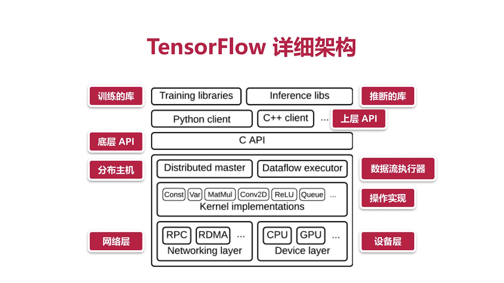
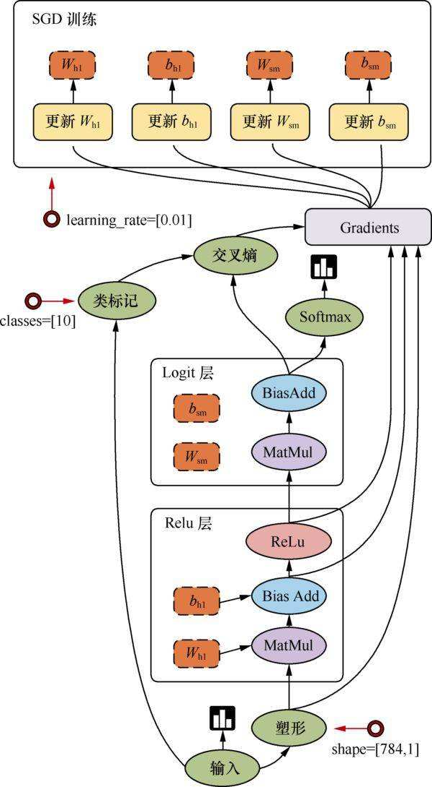
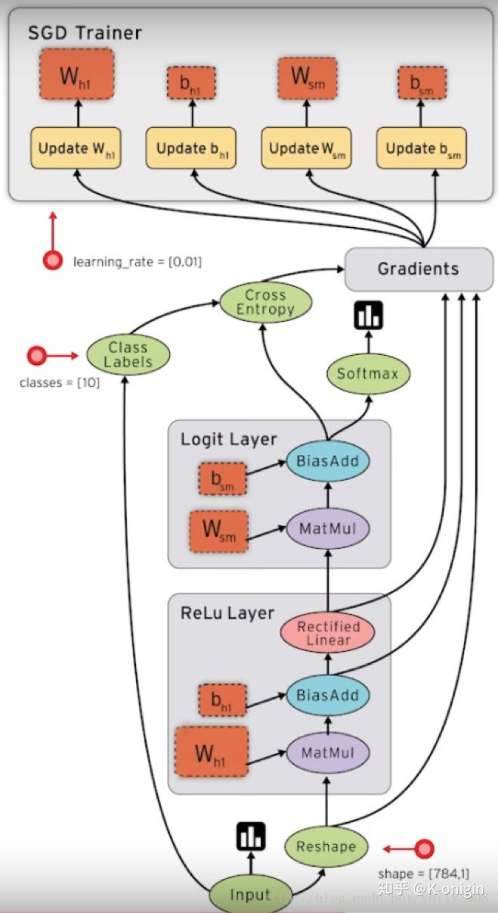
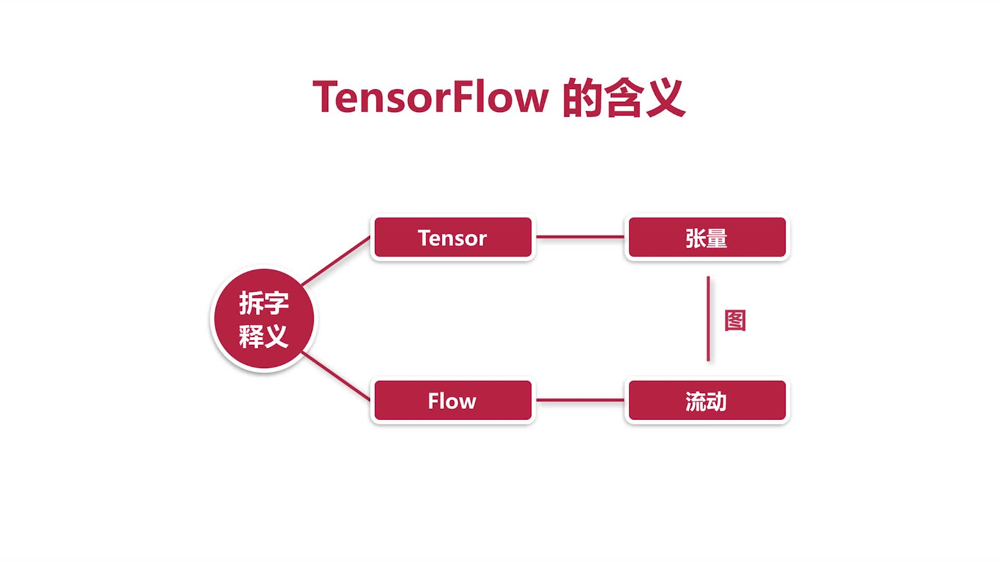
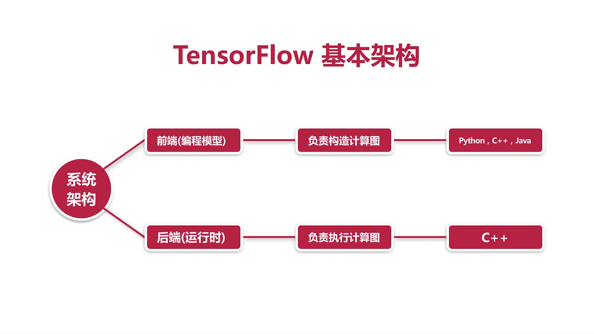
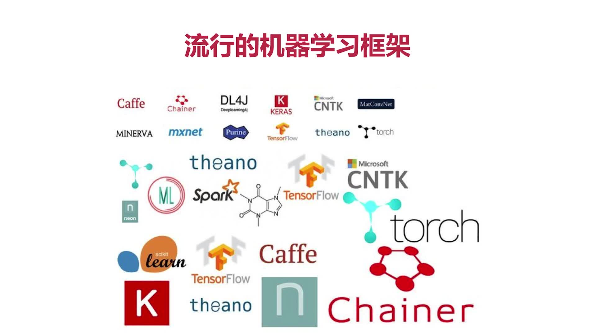
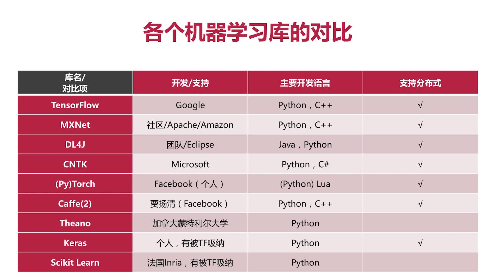
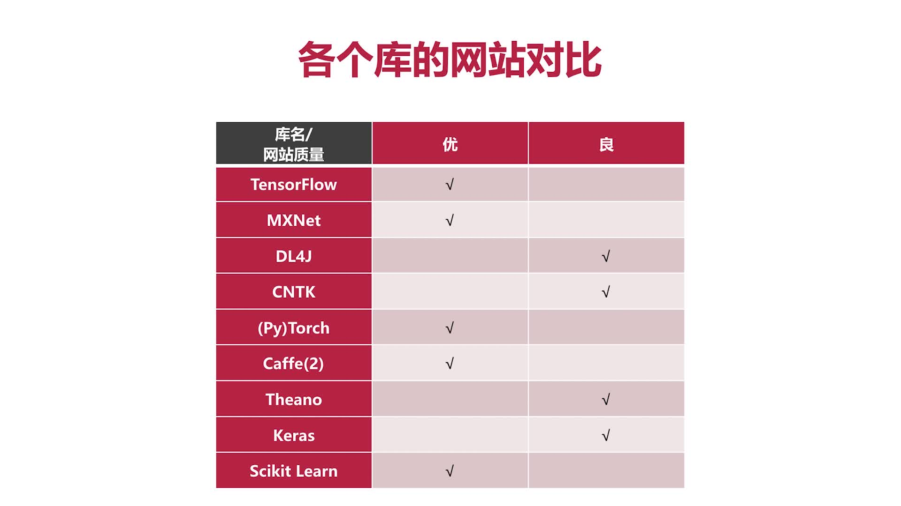

# 第3章 TensorFlow简介和开发环境搭建

## 3.1 什么是TensorFlow

### TensorFlow详细架构

### TensorFlow流图

### TensorFlow含义

### TensorFlow的前后端

### TensorFlow特点

+ **灵活性**：只要可以将计算表示成数据流图，就可以使用TensorFlow
+ **跨平台**：Linux、Android、Windows、IOS、RaspberryPI等等
+ **多语言**：支持多种上层开发语言，如Python、C++、Java和Go等
+ **速度快**：包含了XLA这款强大的线性代数编辑器
+ **上手快**：Keras、Estimiators等等高层API
+ **可移植**：代码几乎不加修改移植到CPU、GPU和TPU等等

## 3.2 TensorFlow和其他机器学习库的对比

### 流行的机器学习框架

### 各个机器学习库的对比

### 各个库的社区网站质量

+ [Keras](https://github.com/keras-team/keras)
+ [TensorFlow](https://github.com/tensorflow/tensorflow)
+ [deeplearning4j](https://github.com/eclipse/deeplearning4j)
+ [pytorch](https://github.com/pytorch/pytorch)
+ [scikit-learn](https://github.com/scikit-learn/scikit-learn)
+ [CNTK](https://github.com/microsoft/CNTK)
+ [mxnet](https://github.com/apache/incubator-mxnet)
+ Caffe和Caffe2已经纳入了PyTorch

### TensorFlow优势：集大成者

+ Google力捧，数据流图，Github王者，社群广大，文档详尽
+ 功能强大的可视化组件TensorBoard和模拟环境Playground
+ 移动端(IOS和Android)、云端、服务器端、分布式、各种硬件

